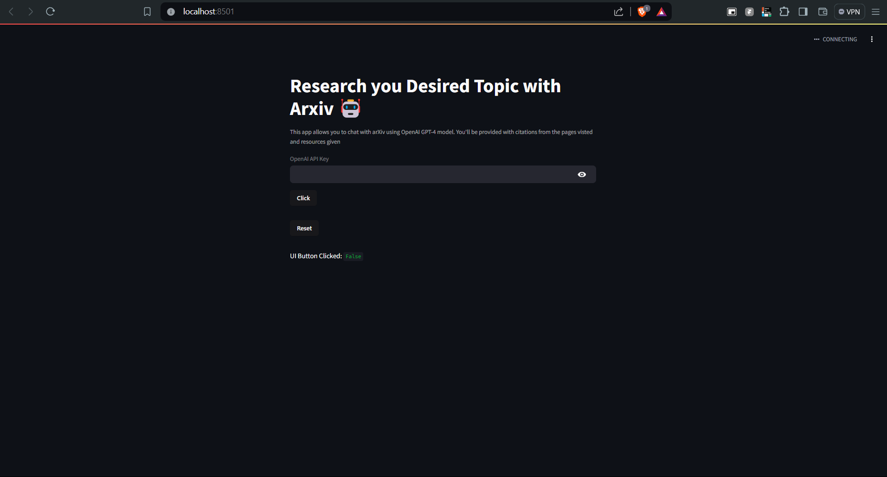

# Research-Agent--Phidata




# AI Research Assistant

This project is an AI Research Assistant built with GPT-4, Streamlit, Phidata, OpenAI, and arXiv. The assistant helps users search and interact with research papers from arXiv using a conversational interface.

## Features

- **Conversational Interface**: Interact with the assistant using natural language queries.
- **Search arXiv**: Retrieve research papers from arXiv based on your queries.
- **Streamlit Web App**: A user-friendly web application built with Streamlit.
- **AI Agents with Phidata**: Utilize Phidata to build AI agents that interact with the OpenAI GPT-4 model.

## Tech Stack

- **Streamlit**: For building the web application.
- **Phidata**: For building AI agents.
- **OpenAI**: For using the GPT-4 model.
- **arXiv**: For accessing research papers.

## Installation

1. **Clone the Repository**:

   ```sh
   git clone https://github.com/garyrmeadeTettey/Research-Agent--Phidata/tree/main.git
   cd virtual
   ```

   2. **Run the Streamlit App**:

   ```streamlit run research.py```


